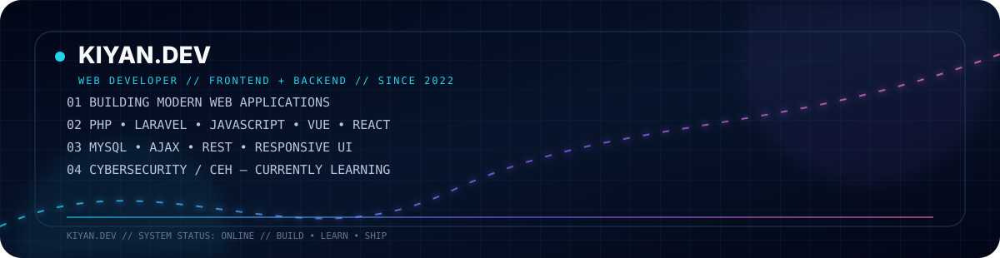
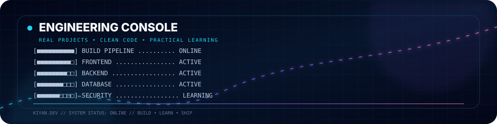
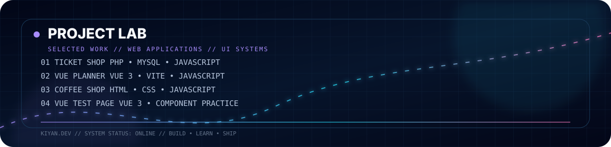
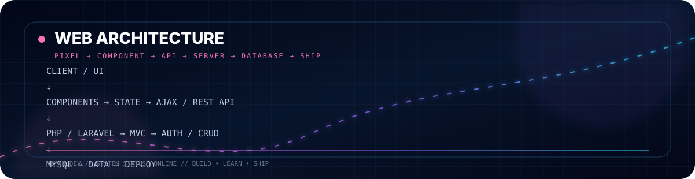
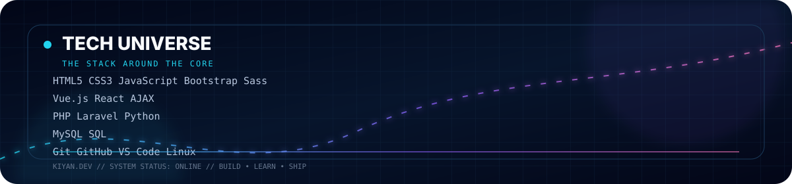
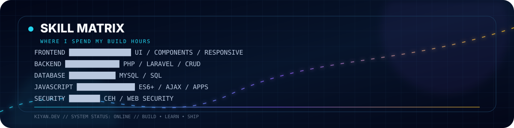
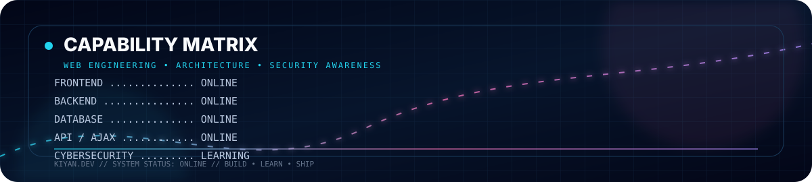
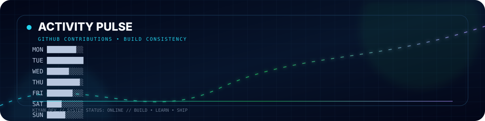
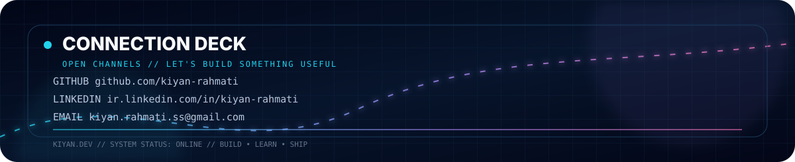
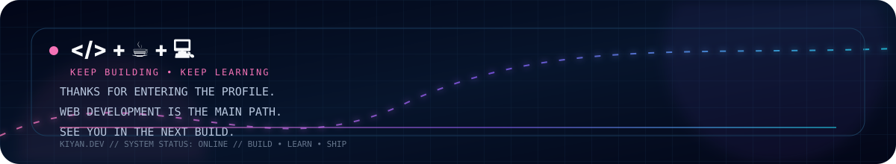

<!--
  Kiyan Rahmati — GitHub profile README
  Inspired by the visual architecture of high-motion developer profiles.
  Live activity/snake are generated by GitHub Actions.
-->

<div align="center">
  
</div>

<div align="center">
  
</div>

<div align="center">
  <a href="https://github.com/kiyan-rahmati?tab=repositories"></a>
  <a href="https://ir.linkedin.com/in/kiyan-rahmati"></a>
  <a href="mailto:kiyan.rahmati.ss@gmail.com"></a>
</div>

<br />

<div align="center">
  
</div>

<br />

<div align="center">
  
</div>

<div align="center">
  <sub>
    <b>01 Ticket Shop</b> — <a href="https://github.com/kiyan-rahmati/ticket_shop">Source</a>
    &nbsp;&nbsp;|&nbsp;&nbsp;
    <b>02 Vue Planner</b> — <a href="https://github.com/kiyan-rahmati/planner-vue.js-">Source</a>
    &nbsp;&nbsp;|&nbsp;&nbsp;
    <b>03 Coffee Shop</b> — <a href="https://github.com/kiyan-rahmati/test_coffe_shop">Source</a>
    &nbsp;&nbsp;|&nbsp;&nbsp;
    <b>04 Vue Test</b> — <a href="https://github.com/kiyan-rahmati/vue_test_page">Source</a>
  </sub>
</div>

<br />

<div align="center">
  
</div>

<br />

<div align="center">
  
</div>

<br />

<div align="center">
  
</div>

<br />

<div align="center">
  
</div>

---

<div align="center">
  <h2>⚡ Live GitHub Signals</h2>
  <sub>REAL PROFILE METRICS • CONTRIBUTION HISTORY • BUILD CONSISTENCY</sub>
</div>

<div align="center">
  
  
</div>

<br />

<div align="center">
  <a href="https://github.com/kiyan-rahmati">
    
  </a>
  <a href="https://github.com/kiyan-rahmati?tab=repositories">
    
  </a>
</div>

<br />

<div align="center">
  <a href="https://github.com/kiyan-rahmati">
    
  </a>
</div>

### 🚀 Recent public work
<!--START_SECTION:activity-->
1. Waiting for the first automated profile activity update.
<!--END_SECTION:activity-->

<br />

<div align="center">
  <h2>📡 Contribution Visualization</h2>
  <sub>SNAKE GENERATED FROM THE REAL GITHUB CONTRIBUTION GRAPH</sub>
</div>

<div align="center">
  
</div>

<br />

<div align="center">
  <picture>
    <source media="(prefers-color-scheme: dark)" srcset="./assets/github-contribution-snake-dark.svg" />
    <source media="(prefers-color-scheme: light)" srcset="./assets/github-contribution-snake.svg" />
    
  </picture>
</div>

---

## 🧭 Developer Path

```text
2022
  │
  ├── HTML / CSS
  ├── JavaScript
  ├── Bootstrap / Sass
  │
  ├── Vue.js / React
  │
  ├── PHP / MySQL / AJAX
  ├── Laravel / Backend
  │
  └── CEH / Cybersecurity → CURRENTLY LEARNING
                               │
                               ▼
                         FULL-STACK WEB
```

<div align="center">
  <sub><b>Web Development is the main path.</b> Cybersecurity is a complementary learning track.</sub>
</div>

---

## 🧩 Core Stack

<div align="center">
  
</div>

---

## 👨‍💻 About

I'm **Kiyan Rahmati**, a Computer Engineering student at the **University of Gilan** and a web developer focused on building practical, modern web applications.

I started my web-development journey in **2022**. My main direction is **Frontend + Backend Web Development**, while CEH and cybersecurity are complementary areas I'm currently learning.

> **Build → Break → Understand → Improve.**

---

<div align="center">
  
  <br /><br />

  <a href="https://github.com/kiyan-rahmati"></a>
  <a href="https://ir.linkedin.com/in/kiyan-rahmati"></a>
  <a href="mailto:kiyan.rahmati.ss@gmail.com"></a>

  <br /><br />
  
</div>
